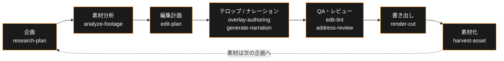

[English](./README.md) | **日本語**

**動画を投げるだけで、いい感じに編集されている。開いて確認して、直したいところだけ直す。**

**[akari.video](https://akari.video/)** — 公式サイト · **[AKARI Video Lab](https://akari.video/lab/)** — AI が理解して使える素材ライブラリ（新設） · [使い方ガイド](https://akari.video/howto/)

AKARI Video は AI エージェントが編集の主体になる動画編集ツールです。
アプリは「編集する場所」ではなく「確認して直す場所」。素材を渡すと、分析・カット・テロップ・
ナレーション・BGM までエージェントが組み上げ、人間は仕上がりを見て意図とのズレだけを直します。

> **意図は人、手は AI。**

**Status: under construction** — シェルアプリは移行中（旧シェル実装は
[akari-video-tauri](https://github.com/AkariLabs/akari-video-tauri) に保存）。
ヘッドレス経路（opencode / Claude Code / Cursor Agent + スキル）は今日から使えます。

## なぜ作ったか

動画編集を AI に「時短のため」に投げると、誰が作ったかわからない量産コンテンツが出てくる。
かといって自分で全部やれば、カット・文字起こし・テロップ・整音で一日が終わる。

AKARI Video はその二択を壊すために作りました。

- **人間の役割は 2 つだけ** — 何を作りたいかを伝えること。仕上がりが自分らしいかを確認すること。
  それ以外（解析・カット判断・ドラフト・整形・検証）はエージェントが引き受ける
- **確認と微修正が最短距離** — 開いたらほぼ終わっている。タイムラインをゼロから組む画面ではなく、
  できあがった編集をレビューして、ドラッグと一言で直す画面
- **あなたの判断が残る** — 承認ゲートと決定ログで「どこを人間が決めたか」が常に追跡できる

## 仕組み — セーブデータがすべて

エージェントと人間は同じセーブデータ（ファイル契約）の上で協働します。

  

- **`edit.json` が編集の SSOT** — エージェントはツール呼び出しの積み重ねではなく、
  セーブデータを直接読み書きする。速く、壊れず、diff で追える
- **表現にプリセットはない** — 字幕・テロップ・図形・3D は AI が HTML/CSS/Three.js で自由に描く。
  受け口は広いが、エンジンは合成だけ
- **人間の操作もデータに着地する** — ドラッグや値の調整は `edit.json`・data 属性・CSS 変数に
  書き戻される。人間と AI が同じファイル上で衝突しない
- **headless-first** — UI がなくても opencode、Claude Code、Cursor Agent だけで企画から書き出しまで完結する。
  アプリはあとから同じプロジェクトを開いて続きができる

ワークフローは段階ごとにスキル化されています:

## はじめる — 4 つの入口

どの入口から始めても、同じファイル契約（`.akari/` 配下）に収束します。
途中でやめても、別の入口から「続きから」再開できます。

| 入口 | 実体 | 発動方法 |
|---|---|---|
| ターミナル | ワンライナーインストーラー（フル構成 — ブラウザプレビュー込み）→ `akari.sh` | `curl -fsSL https://raw.githubusercontent.com/AkariLabs/akari-video/main/install.sh \| bash` — CLI だけ軽量に入れるなら `npm i -g akari-video` |
| opencode セッション内 | `.opencode/skills/` から自動発見 | 「新しい動画プロジェクトを作りたい」と発話 |
| Claude Code セッション内 | `plugin/` の `/akari` コマンド + SessionStart hook | セッション内で `/akari`、または「新しい動画プロジェクトを作りたい」と発話 |
| Cursor Agent | `.cursor/skills/`（モノレポ）またはプロジェクトのアダプタから自動発見 | リポジトリまたはプロジェクトフォルダを Cursor で開き、「新しい動画プロジェクトを作りたい」と発話 |
| アプリ | Theia ベースのデスクトップシェル | 「はじめる」画面の接続ボタンから |

最初の一歩は [docs/getting-started.ja.md](./docs/getting-started.ja.md) へ。

## ドキュメント

- **[Introduction](./docs/introduction.ja.md)** — 思想と全体像
- **[Getting Started](./docs/getting-started.ja.md)** — 最初のプロジェクトを作る
- **[Guides](./docs/README.ja.md#guides)** — 「素材を分析する」「編集計画を立てる」「書き出す」などタスク別ガイド
- **[スキルカタログ](./docs/skills.ja.md)** — 22 スキルの一枚地図（各スキルの担当と接続先）
- **[How-to](./docs/README.ja.md#how-to)** — 接続と API キー・プロジェクト構成・続きから再開
- **[Reference](./docs/README.ja.md#reference)** — `edit.json` などファイル契約のスペック
- 入口: [docs/README.ja.md](./docs/README.ja.md)

## Layout

- `apps/shell/` — Theia ベースのデスクトップシェル
- `packages/` — シェル非依存ライブラリ（schemas・プレビューエンジン・surface runtime・`akari-launcher`）
- `templates/` — プロジェクト scaffold（`.opencode/` 設定を含む）
- `skills/` — エージェント側ステージスキル（18 本）
- `plugin/` — Claude Code プラグインバンドル（スキルパック + SessionStart hook + `/akari`）
- `catalog/` — キュレーション済みアドオンカタログ（参照配布のみ）
- `docs/` — ユーザードキュメント + スペック契約

## License

コードは [MIT License](./LICENSE)。`assets/` / `catalog/` 経由で扱う素材は
それぞれの `meta.json` に記載されたライセンス表記に従います。
