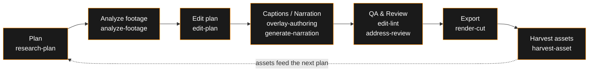

**English** | [日本語](./README.ja.md)

**Hand over your footage and it comes back edited. Open it, review it, fix only what matters.**

**[akari.video](https://akari.video/)** — official site · **[AKARI Video Lab](https://akari.video/lab/)** — AI-ready asset library (newly launched) · [How-to guide](https://akari.video/howto/)

AKARI Video is a video editor where an AI agent does the editing.
The app is not a place to edit — it is a place to review and fix. Give the agent your footage
and it assembles everything from analysis and cuts to captions, narration, and BGM, while you
look at the result and correct only where it drifts from your intent.

> **Intent is human. Hands are AI.**

**Status: under construction** — the desktop shell is mid-migration (the previous shell
implementation is preserved at [akari-video-tauri](https://github.com/AkariLabs/akari-video-tauri)).
The headless path (opencode + Claude Code + Cursor Agent + skills) is usable today.

## Why this exists

Throw video editing at an AI "to save time" and you get mass-produced content nobody can call
their own. Do it all yourself and cutting, transcription, captions, and audio cleanup eat the
whole day.

AKARI Video was built to break that trade-off.

- **Humans do exactly two things** — say what you want to make, and check that the result
  feels like you. Everything else (analysis, cut decisions, drafting, formatting, verification)
  is the agent's job
- **Review-and-tweak is the shortest path** — the edit is nearly finished when you open it.
  Not a screen for building a timeline from scratch, but a screen for reviewing a finished edit
  and fixing it with a drag and a sentence
- **Your decisions stay on record** — approval gates and decision logs keep "what the human
  decided" traceable at all times

## How it works — the save file is everything

The agent and the human collaborate on the same save data (file contracts).

  

- **`edit.json` is the single source of truth** — instead of stacking tool calls, the agent
  reads and writes the save data directly. Fast, robust, diffable
- **No presets for expression** — captions, titles, shapes, and 3D are drawn freely by AI in
  HTML/CSS/Three.js. The intake is wide open; the engine only does compositing
- **Human actions land in data too** — drags and value tweaks are written back to `edit.json`,
  data attributes, and CSS variables. Humans and AI share the same files without colliding
- **Headless-first** — everything from planning to export works with opencode, Claude Code, or
  Cursor Agent alone, no UI required. The app can open the same project later and continue

The workflow is packaged as skills, one per stage:

## Getting started — four entrances

Whichever entrance you start from, everything converges on the same file contracts
(under `.akari/`). Stop halfway and you can resume from any other entrance.

| Entrance | What it is | How to launch |
|---|---|---|
| Terminal | One-line installer (full setup — browser preview included) → `akari.sh` | `curl -fsSL https://raw.githubusercontent.com/AkariLabs/akari-video/main/install.sh \| bash` — CLI only: `npm i -g akari-video` |
| Inside an opencode session | Skills auto-discovered from `.opencode/skills/` | Just say "I want to start a new video project" |
| Inside a Claude Code session | `/akari` command + SessionStart hook in `plugin/` | Type `/akari` in a session, or just say "I want to start a new video project" |
| Inside Cursor Agent | Skills auto-discovered from `.cursor/skills/` (monorepo) or project adapters | Open the repo or project folder in Cursor and say "I want to start a new video project" |
| Desktop app | Theia-based desktop shell | From the connect button on the Start screen |

> `npm i -g akari-video` never uses sudo. If it fails with `EACCES` (permission error),
> prefer `install.sh` above (user-space, no admin password needed) or configure an npm
> user prefix instead. The desktop app provisions its own `akari` CLI automatically —
> no separate install needed there.

First steps: [docs/getting-started.md](./docs/getting-started.md).

## Documentation

- **[Introduction](./docs/introduction.md)** — philosophy and the big picture
- **[Getting Started](./docs/getting-started.md)** — create your first project
- **[Guides](./docs/README.md#guides)** — task-based guides: analyze footage, plan the edit, export, …
- **[Skills Catalog](./docs/skills.md)** — the 22-skill map: what each owns and what it connects to
- **[How-to](./docs/README.md#how-to)** — connections & API keys, project structure, resuming a session
- **[Reference](./docs/README.md#reference)** — specs for file contracts such as `edit.json`
- Entry point: [docs/README.md](./docs/README.md)

> [!NOTE]
> Reference documents (data-contract specs and design notes) are currently Japanese-only.
> Opening an issue for a contract you need in English is welcome.

## Layout

- `apps/shell/` — Theia-based desktop shell
- `packages/` — shell-independent libraries (schemas, preview engine, surface runtime, `akari-launcher`)
- `templates/` — project scaffolds (include `.opencode/` config)
- `skills/` — agent-side stage skills (22 of them)
- `plugin/` — Claude Code plugin bundle (skill pack + SessionStart hook + `/akari`)
- `catalog/` — curated add-on catalog (reference-only distribution)
- `docs/` — user docs + spec contracts

## License

The code is under the [MIT License](./LICENSE). Assets handled via `assets/` / `catalog/`
follow the license notice in each item's `meta.json`. Bundled third-party binaries
(ffmpeg / ffprobe, GPL builds) are documented in [NOTICE.md](./NOTICE.md).
